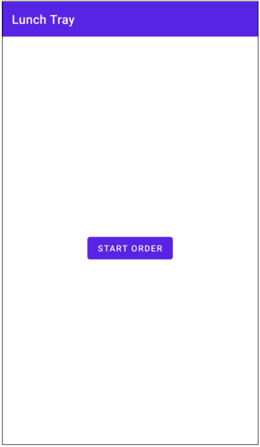
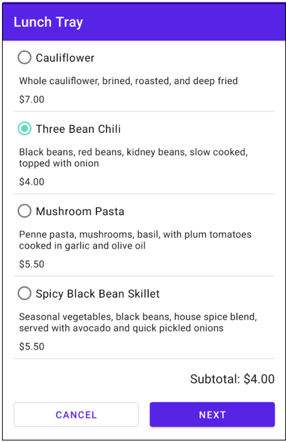
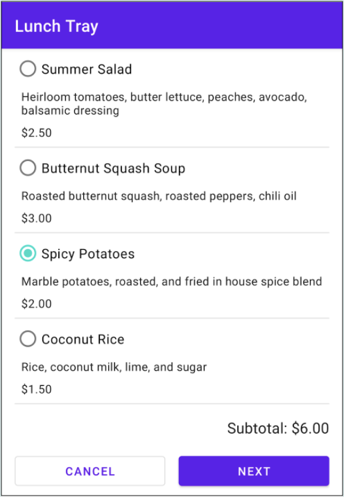
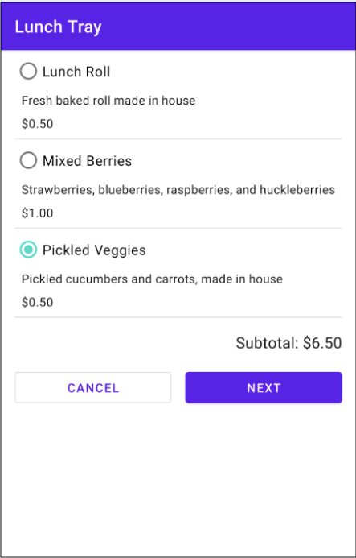
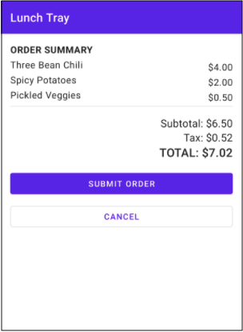
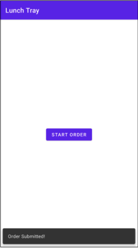

# LunchTray
## Welcome to Project: Lunch Tray!

As you're probably aware, navigation is a fundamental part of Android development. Whether you're using an app to browse recipes, find directions to your favorite restaurant, or most importantly, order food, chances are that you're navigating multiple screens of content. In this project, you'll leverage the skills you learned in Unit 3 to build out a lunch ordering app called Lunch Tray, implementing a view model, data binding, and navigation between screens.

Below are the final app screenshots. When first launching the Lunch Tray app, the user is greeted with a screen with a single button that says "Start Order".

After clicking Start Order, the user can then select an entree from the available choices. The user can change their selection, which updates the Subtotal shown at the bottom.

The next screen allows the user to add a side dish.

The screen after that allows the user to select an accompaniment for their order.

Finally, the user is shown a summary of the cost of their order, broken down into subtotal, sales tax, and total cost. They can also submit or cancel 
the order.

Both options return the user to the first screen. If the user submitted the order, a toast should appear at the bottom of the screen letting them know 
that the order has been submitted.

